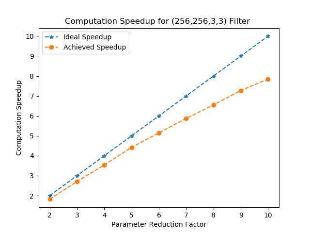

# DeGirum SmartSkip Compute Technology
## Introduction
Pruning weights is one of the techniques to reduce the number of parameters and compue operations in neural networks. A variety of approches have been studied for pruning, from fine-grained element-wise pruning to coarse grained methods in which entire filters are pruned. See the [Documentation Page](https://nervanasystems.github.io/distiller/index.html) of the [Distiller](https://github.com/NervanaSystems/distiller) repo from [Nervana Systems](https://github.com/NervanaSystems) for a very good introduction and overview of various pruning techniques.

Recently, pruning API has been added to [TensorFlow ](https://www.tensorflow.org/). See the [announcement](https://medium.com/tensorflow/tensorflow-model-optimization-toolkit-pruning-api-42cac9157a6a). While the current gains are mainly from model compresssion, latency improvements have been mentioned as [future work](https://github.com/tensorflow/model-optimization/blob/master/tensorflow_model_optimization/g3doc/guide/pruning/index.md).

## Current State
Pruning has so far been seen as a method to reduce the number of parameters, thereby reducing the model size. This is attractive for edge applications which are resource constrained. There have been some efforts to leverage pruning to provide latency improvements, notably on FPGA platforms by [Xilinx](https://www.xilinx.com/applications/megatrends/machine-learning.html). Special libraries to handle sparsity have also shown some gains. See Baidu's [benchmark results](https://github.com/baidu-research/DeepBench) for different cases. It is worth noting that the gains are mainly reported for fully connected layers and for sparsity of 90% or more. While pruning fully connected layers reduces the number of parameters signifcantly, it does not result in significant computation reduction. Consequently, the gains acheived can mainly be due to DRAM bandwidth savings. 

Some network architectures such as the recurrent neural networks used in natural langugage processing(NLP) applications and speech applications (speech-to-text and text-to-speech) have a lot of parameters. While these networks are also computationally intensive, the parameter reuse is very less thereby making their performance memory bound. Moreover, from a system cost point of view, compute is seen as cheaper than memory bandwidth. Hence, it is no wonder that some architetcures exploit sparsity only for reducing memory bandwidth and not computation. These architetcures typically store compressed weights in system memory, decompress the weights to their full size on chip and compute on the full matrix ([TensorFlow Lite](https://www.tensorflow.org/lite) can be thought of as one example where model compression is used as an optimization technique).

Convolutional neural networks (CNNs) on the other hand have excellent reuse of filter weights and are computationally much more intensive. Networks used for image classification easily have the number of multiply-accumulate (MAC) operations in the order of billions whereas networks for object detecion run into tens of billions of MACs. Image segmentation networks can have hundreds of billions of operations. See the [convnet-burden](https://github.com/albanie/convnet-burden) for an overview of computation burden in different networks. While the network sizes are large in these cases, the computation load can be so high as to make these networks compute bound. Hence, for convolutional neural networks, properly designed hardware can exploit sparsity to reduce computation and provide latency improvements.

Researchers working on pruning methods have found that carefully pruned models with much less number of parameters and operations do not provide any performance improvement (in terms of frames per second), even on custom HW. Such observations have even led to questiong of the usage of pruning as an optimization technique. See the paper [Pruning neural networks: is it time to nip it in the bud?](https://openreview.net/forum?id=r1lbgwFj5m) for some interesting comments and conclusions.

**NOTE:** We have tried to provide a general overview of the current state regarding pruning: (a) references to research (by pointing to documentation page of Distiller) (b) tools used (TesnorFlow, Distiller), (c) state of HW (Baidu benchmark numbers, Xilinx FPGA link), (d) our take on sparsity and (e) counterpoint views. We understand that the above overview is by no means exhaustive. If you are aware of any other work that can add to this overview, please let us know by opening an issue. Also, if any of our understanding of the work of others is incorrect, please let us know.

## Our Technology
At DeGirum, we are building SoCs suitable for edge inference applications. Powered by our SmartSkip technology, our hardware leverages the sparsity in neural networks to provide significant performance improvements. Our compute architecture provides near optimal support for sparse matrix multiplication and convolution thereby reducing the overall latency of the forward path. 

A key feature of our architecture is the near optimal computation speed up achieved for sparsity in the range of 50%-90% for convolutional as well as fully connected layers. In the figure below, we show the computation speedup achieved for various values of parameter reduction (defined as 100/(100-sparsity%)). For example, if we have a matrix with 80% sparsity i.e., if 80% of the elements of the matrix are zero, then the parameter reduction is 100/(100-80) = 5. In other words, the sparse matrix has 5x less entries than the dense matrix. If such a matrix is used in Matrix Multiplication, the number of computations is ideally 5x less than the computation for the dense matrix. Equivalently, there should be 5x speedup in computation. 

The figure below shows that the computation speedup in our architecture for various parameter reduction values for a 3x3 convolutional layer with 256 filters and 256 channels. In general, for a given sparsity, computation speed up increases as we have more channels. 

## Relation Between Parameter Reduction and Compute Reduction
For a single layer, the relationship between parameter reduction and computation speedup is straightforward. However, for a network composed of multiple layers, filter coefficients in different layers have different reuse. Pruning a coefficient in initial layer saves more computation than pruning a coefficient in later layers. Similarly, for the same percentage of pruning, later layers reduce the absolute number of parameters much more than earlier layers.

Consider a simple network made of the following two layers: 

Layer   | Input Shape (h, w, c) | Filter Shape (h, w, c) | Number of Filters | Output Shape (h, w, c) | Num. Filter Params | Num. MACs
--------|-----------------------|------------------------|-------------------|------------------------|--------------------|-----------
Layer0  | (56, 56, 64)          | (3, 3, 64)             | 256               | (28, 28, 256)          | 147456             | 115.6M
Layer1  | (28, 28, 256)         | (3, 3, 256)            | 256               | (14, 14, 256)          | 589824             | 115.6M 

Pruning Layer0 by 50% reduces number of parameters by 73728 while cutting the MACs by 57.8Million. Pruning Layer1 by 50% reduces number of parameters by 294912 while cutting the MACs by the same number 57.8M MACs. Unless all the layers are pruned by the same ratio, the overall reduction in number of parameters cannot always give an accurate estimation of computation reduction. Hence, in our results we report both the parameter reduction and computation reduction. Parameter reduction is useful for saving DRAM bandwidth and computation reduction is useful for saving the number of MAC units in the HW.

## Our Results
In this section, we share our results on the performance of pruned networks for different models. The pruned models have been obtained using the [Distiller Tool](https://github.com/NervanaSystems/distiller). The Distiller tool also has options to evaluate the performance of [quantized models](https://github.com/NervanaSystems/distiller/tree/master/examples/quantization/post_train_quant). We report results for post-training quantization in which the weights and activations are quantized using 8-bits. The quantization scheme used is asymmetric and the activations are not clipped (option 6 in this [table](https://github.com/NervanaSystems/distiller/blob/master/examples/quantization/post_train_quant/command_line.md#sample-invocations). Further, we report the current computation speedups achieved on our HW prototype (FPGA implementation of our final ASIC solution). The numbers will improve as the design matures and more HW features are integrated onto FPGA. It can however be seen that we already achieve respectable computation speedup for different pruned networks. 

Currently, we have results for ResNet50 trained on ImageNet dataset. We will be adding results for other image classification models (e.g. Inception-v3, DenseNet161, MobileNet etc) and object detection models (e.g. Yolo-v3) in the near future. 

Various research studies show that language models as well as models used in speech recognition can be pruned by as much as 90% without sacrificing accuracy. Moreover, sparse models have been found to outperform dense models with the same number of parameters. See [1](https://arxiv.org/pdf/1704.05119.pdf) and [2](https://arxiv.org/pdf/1710.01878.pdf) for some very interesting results. Reporting results for these models on our HW is also on our roadmap.

### Image Classification
Name of Network     | Number of GMACS (Compute Reduction) | Number of Parameters (Parameter Reduction) | Top1/Top5 Accuracy (fp32) | Top1/Top5 Accuracy (INT8) | Achieved Compute Gains in HW (fp32) | Model State Dict
--------------------|-----------------|----------------------|--------------------|-----------------|-----------|----
ResNet50            | 4.089 (1.00x)   | 25.5M (1.00x)        | 76.130/92.862      | 75.702/92.680   | 1.00      | Get from torchvision models
ResNet50_Pruned_70  | 1.846 (2.21x)   | 7.48M (3.41x)        | 75.944/92.960      | 75.504/92.662   | 2.00      | link
ResNet50_Pruned_83  | 1.143 (3.58x)   | 4.24M (6.01x)        | 75.766/92.920      | 75.194/92.634   | 2.73      | link 
ResNet50_Pruned_85  | 0.714 (5.73x)   | 3.93M (6.48x)        | 75.516/92.718      | 74.874/92.376   | 3.86      | link

## Reproducing Our Results
In order to enable the research community as well as product developers to replciate our results, we are providing links to download the training checkpoints as well as the mode state dictionaries for our pruned models. We also provide the pruning schedule yaml files used to generate the pruned models (on Distiller). The yaml file contains other important metadata such as the accuracy performance, the command lines to run training,evaluation and quantization, the sparsity profile, the best epoch number and the ideal number of MACS needed for the pruned network.

Name of Network     | Model Checkpoint  | Model State Dict  | Pruning Scheduler 
--------------------|-------------------|-------------------|------------------
ResNet50_Pruned_70  | [ckpt](https://degirum-model-checkpoints.s3.amazonaws.com/pruned_models/resnet50_pruned_70_best.pth.tar) | [state dict](https://degirum-model-checkpoints.s3.amazonaws.com/pruned_models/resnet50_pruned_70_state_dict.pth)                  | [resnet50_pruned_70_schedule.yaml](pruned_models/resnet50_pruned_70_schedule.yaml)
ResNet50_Pruned_83  | [ckpt](https://degirum-model-checkpoints.s3.amazonaws.com/pruned_models/resnet50_pruned_83_best.pth.tar) | [state dict](https://degirum-model-checkpoints.s3.amazonaws.com/pruned_models/resnet50_pruned_83_state_dict.pth)            | [resnet50_pruned_83_schedule.yaml](pruned_models/resnet50_pruned_83_schedule.yaml)
ResNet50_Pruned_85  | [ckpt](https://degirum-model-checkpoints.s3.amazonaws.com/pruned_models/resnet50_pruned_85_best.pth.tar) | [state dict](https://degirum-model-checkpoints.s3.amazonaws.com/pruned_models/resnet50_pruned_85_state_dict.pth)                 | [resnet50_pruned_85_schedule.yaml](pruned_models/resnet50_pruned_85_schedule.yaml)

### Using Pytorch
The performance of our pruned models can be replicated using this [jupyter notebook](EvalPrunedModelsStateDict.ipynb) which uses state dictionary and this [jupyter notebook](EvalPrunedModelsStateDict.ipynb) which uses the checkpoint. The notebooks are self-contained and only require pytorch to be installed (tested with Pytorch 1.1.0). 

### Using Distiller
With Distiller installed, one can replciate our results on quantization as well as train models from scratch to obtain the pruned models with desired sparsity profile. 

## Call for Collaboration
We are very excited to share our results on the benefits of using pruned neural networks. While the results so far in the published literature pointed to the potential gains, these have largely not been realized on HW. We are confident that our HW solutions will enable researchers and product managers to exploit sparsity and develop low power, low cost solutions that do not sacrifice on accuracy and bring cloud quality AI to the edge. We welcome you to develop your sparse net applications on our HW and will extend any support possible. Our test chip is expected to be in Q2 of 2020, but we already have FPGA system to help developers. 
## Acknowledgements
1. We owe a debt of gratitude to the group maintaining Distiller repo. All our pruned models have been obtained by using their package.
2. The pytorch community
